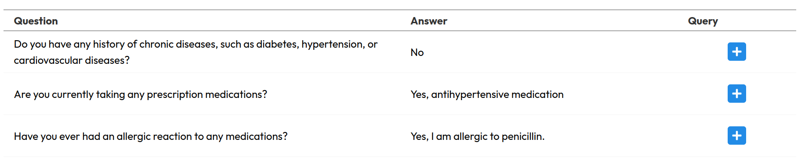
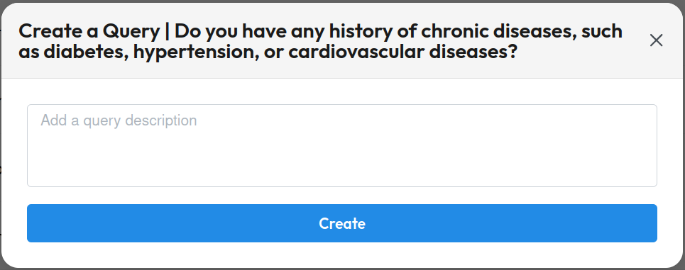
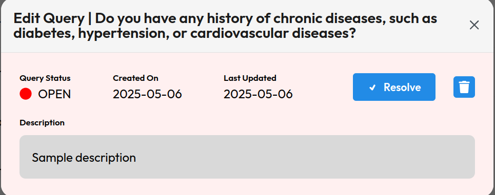
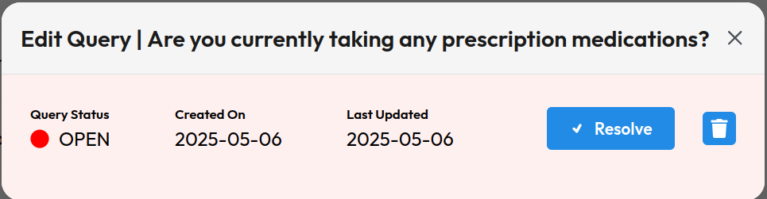
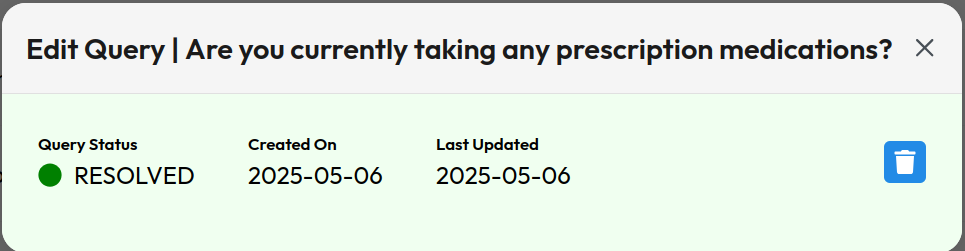

# Solution to Vial Take Home Assignment

Hello, my name is Andrew and this is my solution to the vial take home assignment, in this readme I will describe how to run this project locally, how to run the tests and also provide the link to the API documentation as well as the link to the live hosted version of the project.

## Running the project locally
To run this project locally follow the following steps;
- `cd backend`
- create a .env file by copying the .env.example file which was provided to start this project
Then run the following commands in order:
- `docker-compose build`
- `docker-compose up`
- `npm run migrate`
- `npm run seed`
- You should be able to access the server locally at http://localhost:8080 
At this point the backend server should be running now we can launch the frontend website by running the following commands in order:
- `cd ../frontend`
- `npm i`
- `npm run dev`
- You should be able to access a local version of the website at http://localhost:3000  
You can also run the front end first with the following commands
- `cd frontend`
- `npm i`
- `npm run dev`
- You should be able to access a local version of the website at http://localhost:3000 
Then you can start the backend with the following
- `cd ../backend`
- create a .env file by copying the .env.example file which was provided to start this project 
Then run the following commands in order:
- `docker-compose build`
- `docker-compose up`
- `npm run migrate`
- `npm run seed`
- You should be able to access the server locally at http://localhost:8080 

## Features
### Frontend
When you enter into the website you should see a table with 3 columns, Question, Answer, Query and it would look like this

If you hover over the plus sign you will see a tool tip indicating that you can create a query by clicking on the button, once you click a modal will be opened up which will allow you create a query, the modal will look like this,

Adding a description is optional, if you create a query it will start as OPEN, queries with and without descriptions look similar the only difference is queries without descriptions wont have a description when you view them here are some examples below of how they will look,

A resolved query will look like this,

You can delete a query by clicking the trash button in the view query modal.

### Backend (API)
There is a simple RESTful API for queries made with node.js and prisma with the following endpoints
- GET /form-data: This endpoint returns all the form data and related query data in the database
- POST /query: This endpoint creates a new query
- PUT /query/{id}: This endpoint updates the query which has an id of id
- DELETE /query/{id}: This endpoint deletes the query which has an id of id  
- Note: API documentation was made with swagger and can be viewed at http://localhost:8080/documentation, please note the backend server needs to be running in order to view the documentation, you can start the server and populate the database with the seed data using the first 6 steps in the Running the Project Locally section.

### Database
- There exists the **form data model** with the following fields:
    - `id`: Unique identifier (UUID).
    - `question`: String, required
    - `answer`: String, required
    - `query`: relational field to a Query
- The **query model** should have the following fields:
    - `id`: Unique identifier (UUID).
    - `title`: String, required.
    - `description`: String, optional.
    - `createdAt`: String, required.
    - `updatedAt`: String, required.
    - `status`: String, possible values (OPEN, RESOLVED).
    - `formData`: relational field to a formData
    - `formDataId`: the relational foreign key id of the formData

### Testing
There is a simple test that should test the API, these test cases require the server to be running in order to run the tests, you can start the server and populate the database with the seed data using the first 6 steps in the Running the Project Locally section. If the server is running you can run the test with the following command
- `npm run test`

Unfortunately I was unable to host the website online, nevertheless, thank you for the OA I was able to learn alot and it was fun.